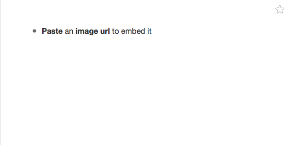
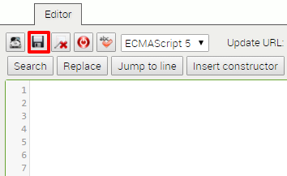
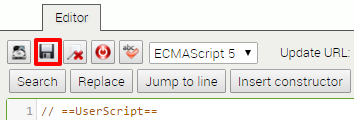

# WorkFlowy Images

A [Chrome
Extension](https://chrome.google.com/webstore/detail/cnecfoeoohjnimhbcojcdfhhdllgleck)
(and [Tamperemonkey script](#Tampermonkey-Installation)) to embed images into
your [WorkFlowy](http://workflowy.com).



## Installation

1. If you haven't already, signup for a [WorkFlowy](https://workflowy.com)
   account.
2. Install one of the following:
  1. The Workflowy Images [Chrome Extension](https://chrome.google.com/webstore/detail/cnecfoeoohjnimhbcojcdfhhdllgleck)
  2. Or if you don't use Chrome, you can install the
     Tampermonkey Script [(directions here)](#Grease-Monkey-Installation)
3. Then in your browser, refresh your `workflowy.com` window to let the
   installation take effect.

## Usage

To embed an image, just paste an image URL _**and nothing else**_ into one
bullet point in WorkFlowy, like so: 

WorkFlowy Images works by taking any URL that ends in `.png`, `.jpg`, `.jpeg`,
.`gif`, and `.bmp` and displaying an image for it.

Therefore, the following image URLs should work if you just paste them directly
into WorkFlowy:

- `https://67.media.tumblr.com/avatar_4f34146efb15_128.png`
- `https://a.wattpad.com/useravatar/TeresaCakies.128.89197.jpg`

For images that don't have the above those file endings, like say
`http://bit.ly/2aD78gM`, you can embed it with Markdown flavored tags:

- ``
- ``
- ``

## Tampermonkey Installation

1. Install the [Tampermonkey](http://tampermonkey.net).
2. Open the [Workflowy Image tampermonkey script](https://raw.githubusercontent.com/jonleung/workflowy-images/master/tampermonkey/workflowy_images_tampermonkey_script.js) and copy the entire contents of that file to your clipboard.
3. Click on your Tampermonkey icon in your Browser and click "Add a new script…"

   > 

4. Select everything in the resulting editor and delete it. It should look blank
   blank like this:

  > 

5. Now in your empty editor, paste the code in  that you just copied from the
   other file.

6. Click the save icon:

   > 

5. Then in your browser, refresh your `workflowy.com` window to let the
   installation take effect.

_(Credit for the Tampermonkey installation directions go to Frank Degenaar. I
  took the directions and screenshots he wrote from [the blogpost he wrote on
  the Workflowy Site](https://blog.workflowy.com/2016/01/06/inline-images/)._

## Credits

I did not come up with this idea.

I read the blogpost ["Get Workflowy Inline Images out of your System in 2016"](https://blog.workflowy.com/2016/01/06/inline-images/) by [Frank Degenaar](https://twitter.com/ProMashUp).

In the blogpost, he talks about how to install and use [a Greasemonkey script he
wrote](https://gist.github.com/Wizmann/605ff2a609348b6ec3a3#file-workflowy-with-image-js)
to embed an image using a Markdown style image embed tag within a WorkFlowy note:

```markdown

```

I took [that original code](https://gist.github.com/Wizmann/605ff2a609348b6ec3a3#file-workflowy-with-image-js),  and remade it to be what WorkFlowy Images is today.

## Blog Post

Here is a link to a [blog post I
wrote](http://jonl.org/hexo-blog/workflowy-images) about this project includes a
small bit on how I use WorkFlowy and why I'm obsessed with it.

## License

[MIT](LICENSE)
